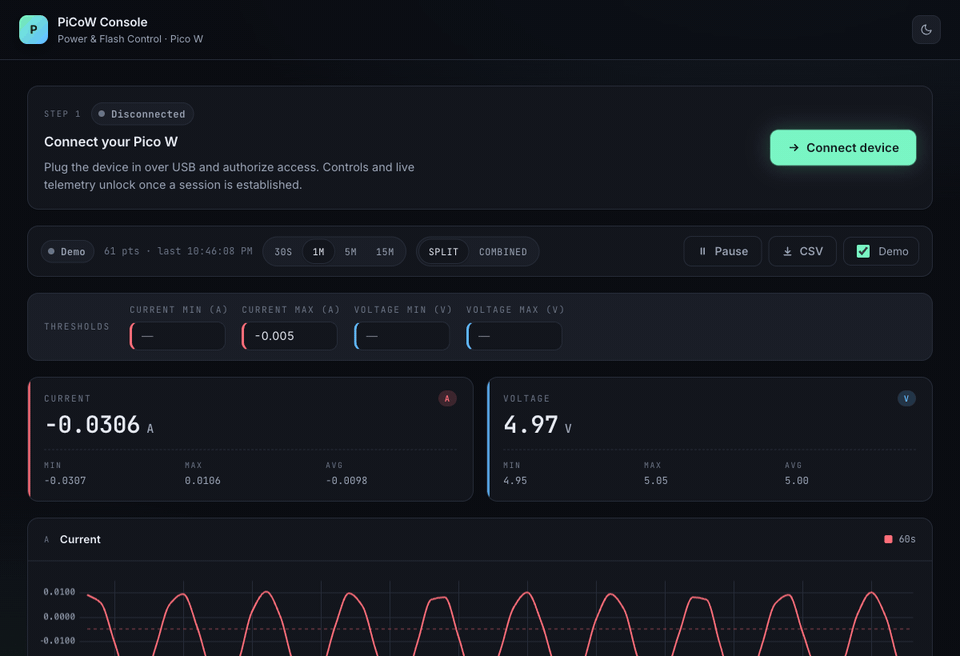

[](https://github.com/elementosystems/picow_webapp/actions/workflows/docker-image.yml)

# PiCoW Console



A browser-based control + telemetry + automation console for a Raspberry Pi
Pico W. Connects to the device over **WebUSB** (vendor `0xcafe`), and to a
Siglent / SCPI-1999 network oscilloscope via a small localhost bridge.

> The animation above is a recording of the live deployment at
> [powerflashutility.bsadashi.work](https://powerflashutility.bsadashi.work)
> running in demo mode — telemetry, threshold alerts, recording sessions,
> scripted test sequences, and the SCPI scope panel.

The companion firmware lives in [PicoWWebUSB](https://github.com/elementosystems/PicoWWebUSB).

> **Browser support:** WebUSB requires a Chromium-based browser (Chrome, Edge,
> Brave, Arc). Firefox and Safari will not connect to the device.

## Features

**Device control**
- Connect / disconnect over WebUSB
- ECU 12V rail toggle, with optional 10-second arming delay
- Flash-mode toggle (drives two GPIOs in lockstep)
- Debugger-power toggle

**Live telemetry**
- Streams `Current: <n> A` / `Voltage: <n> V` from the device
- Two charts (split view) or one dual-axis chart (combined view)
- Range presets (30s / 1m / 5m / 15m), pause, drag-to-zoom
- Live stats per channel (last / min / max / avg)
- CSV export of the in-memory buffer
- Demo mode synthesises a sine wave so you can iterate on the UI without hardware

**Threshold lines + alerts**
- Set min/max for current and voltage; out-of-range readings flip the metric
  card to a red **ALERT** chip and draw a dashed line on the chart
- Threshold values persist in `localStorage`

**Event log + chart markers**
- Every connect / disconnect / control toggle / script step is logged with a
  level (info / warn / error), source, and timestamp
- Each event is also drawn as a colored vertical line on the charts with a
  pill label, with row-staggered collision avoidance for clusters

**Sessions** (`v0.4.0+`)
- Start a recording from the **Recording** disclosure — telemetry samples and
  events are persisted to IndexedDB until you click Stop
- Past sessions list rendered inline: rename, view (modal with full Current /
  Voltage charts + markers), export as CSV or JSON, delete

**Test scripts** (`v0.4.0+`)
- Small JS DSL for automated test sequences: `ecu(on)`, `flash(on)`,
  `debug(on)`, `await wait(ms)`, `assert(cond, msg?)`, `log(...)`,
  `scope.measure(metric, channel?)`, `scope.query(cmd)`, `scope.send(cmd)`
- Saved scripts persist in `localStorage`; three useful defaults ship out of
  the box (toggle ECU, rail-voltage check, enter flash mode)
- Cancellable from the UI — `Stop` aborts any pending `wait()`
- Each `log` / `assert` outcome emits to the event bus, so chart markers and
  the global event log reflect script activity in real time

**Oscilloscope panel**
- Controls a Siglent / SCPI-1999 / IEEE-488.2 network instrument over its LAN
  port (raw socket on TCP:5025 — SDS1000X-E, SDS2000X+, SDS1000X-HD, etc.)
- Run / Stop / Single / Autoset; channel scale + offset + coupling; timebase;
  trigger source / level / mode
- Live measurement grid (Vpp / Vavg / Vrms / Vamp / Vmax / Vmin / Freq /
  Period) at a user-set polling rate
- Data logger with CSV / JSON export (50,000-row soft cap with auto-stop)
- Raw SCPI console with per-line history
- All inputs persist to `localStorage`

**Inline serial console**
- Diagnostic raw-byte view of every USB IN/OUT packet, with hex + ASCII columns
- Send arbitrary bytes from an input bar (ASCII or hex) for poking the firmware

## Prerequisites

1. **Node.js** (v18 or later recommended) — [download](https://nodejs.org/).
   Verify:
   ```bash
   node --version
   npm --version
   ```
2. A Chromium-based browser for runtime (see Browser support note above).

## Setup

```bash
git clone https://github.com/elementosystems/picow_webapp.git
cd picow_webapp
npm install
```

## Development

```bash
npm run dev
```

Vite dev server with HMR at `http://localhost:5173/`.

## Production build

```bash
npm run build
```

The `prebuild` hook runs `scripts/check-versions.js` and refuses to build if
`package.json`, `version.json`, `VERSION`, and the `<meta name="app-version">`
tag in `index.html` disagree. Output goes to `dist/`.

### Bumping the version

`package.json` is the canonical source. Use `npm version <patch|minor|major>`
— the `postversion` hook runs `scripts/sync-versions.js` to propagate the new
value to the three derived files. Don't hand-edit them; if they drift, run
`npm run sync-versions`.

## Deployment

After `npm run build`, deploy the contents of `dist/`. For example via `scp`:

```bash
scp -r dist/* username@server:/path/to/deployment/directory
```

CI also pushes multi-arch Docker images (amd64, arm/v7, arm64) on every tag
— see [Docker image](#docker-image).

## Architecture (brief)

- `src/main.jsx` — React entrypoint
- `src/App.jsx` — page shell, composes the panels
- `src/services/serialService.js` — singleton WebUSB wrapper. The only place
  that touches `navigator.usb`. Exposes telemetry / connection / raw-byte
  subscribers; components subscribe + unsubscribe on mount/unmount.
- `src/services/scopeService.js` — promise-based browser client for the SCPI
  bridge over a single WebSocket
- `src/services/sessions.js` — IndexedDB-backed session recording + replay
- `src/services/scriptRunner.js` — sandboxed script DSL + AbortController
- `src/services/eventBus.js` — pub/sub for app-level events (200-event cap)
- `src/services/settings.js` — JSON-aware `localStorage` wrapper
- `src/components/*` — UI; all device traffic goes through the singleton

There is no Redux/Context. Connection and telemetry state live in the
services; React components mirror via `useState` + subscriber callbacks.

## Oscilloscope (Siglent / SCPI)

Browsers can't open raw TCP sockets, so a tiny local bridge ships with the
repo. It translates `ws://127.0.0.1:8765/ws` to `tcp://<scope-ip>:5025`,
supports IEEE-488.2 binary blocks, and is bound to localhost only.

Start it in a second terminal:

```bash
npm run bridge
```

Then in the app — open the **Oscilloscope** disclosure, enter the scope's
IPv4 (or hostname) + port, set the bridge URL (default
`ws://127.0.0.1:8765/ws`), click **Connect**. The IDN string and live
measurements appear once the handshake succeeds.

The bridge enforces an Origin allowlist (localhost variants only — and CLI
clients with no Origin header) so that a malicious page in your browser
can't use the bridge as an SSRF gateway to scan or command instruments on
your LAN.

### Test without hardware

A simulated Siglent SDS1104X-E ships in this repo. In a third terminal:

```bash
npm run mock-scope
```

It listens on `127.0.0.1:5025` and returns realistic measurements driven by
a slowly-drifting sine wave. In the app, set host = `127.0.0.1`,
port = `5025`, click Connect — full pipeline (UI ↔ bridge ↔ mock scope)
without a real device.

## Docker image

The repo ships a Dockerfile that copies a pre-built `dist/` into nginx, so
**you must run `npm run build` before `docker build`**. CI pushes multi-arch
images (amd64, arm/v7, arm64) to
`harbor.elementosystems.com/pico_webapp/picow_webapp:v<version>-<arch>` plus
a multi-arch manifest tagged `:v<version>`.

Building locally for amd64:

```bash
npm run build
docker build -t picow_webapp .
```

For ARM (e.g. Raspberry Pi):

```bash
docker buildx create --use --name mybuilder
docker buildx build --platform linux/arm/v7 --load -t picow_webapp .   # 32-bit
docker buildx build --platform linux/arm64   --load -t picow_webapp .   # 64-bit
```

Run the container:

```bash
docker run -d -p 8080:80 picow_webapp
```

Then open `http://localhost:8080`.

## Scripts (npm)

| Command | What it does |
| --- | --- |
| `npm run dev` | Vite dev server with HMR |
| `npm run build` | Production build to `dist/` (runs `check-versions` first) |
| `npm run preview` | Preview the built `dist/` |
| `npm run bridge` | Start the SCPI WebSocket-to-TCP bridge on `127.0.0.1:8765` |
| `npm run mock-scope` | Start a simulated Siglent SDS1104X-E on `127.0.0.1:5025` |
| `npm run check-versions` | Verify all four version locations agree |
| `npm run sync-versions` | Propagate `package.json` version to the three derived files |

## Firmware

The on-device firmware that exposes the WebUSB interface, parses commands,
and emits the telemetry stream lives in
[PicoWWebUSB](https://github.com/elementosystems/PicoWWebUSB).
